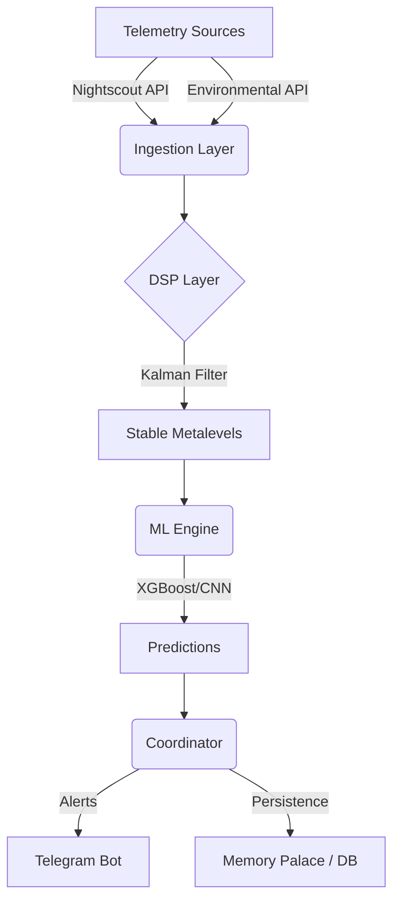

# Architecture

> Auto-generated by Antigravity on 2026-04-27

## Overview

The Bio-Quant Hyperglycemia Faint Predictor is a real-time metabolic intelligence engine designed to predict hypoglycemic and hyperglycemic events using a multi-layered sensor fusion approach. It ingests data from Continuous Glucose Monitors (via Nightscout), environmental sensors, and user telemetry to provide predictive alerts via Telegram.

## Layers

### 1. Ingestion Layer (`diabetic/ingestion/`)
- **Purpose**: Fetching raw data from external sources.
- **Components**: `nightscout.py`, `telemetry.py`.
- **Logic**: Handles authentication, rate limiting, and raw data formatting.

### 2. DSP Layer (`diabetic/dsp/`)
- **Purpose**: Signal processing and noise reduction.
- **Components**: `kalman.py`, `filters.py`.
- **Logic**: Uses Kalman filters to stabilize glucose trends and calculate derivatives (velocity/acceleration).

### 3. ML Engine (`diabetic/ml_engine/`)
- **Purpose**: Predictive modeling.
- **Components**: `inference.py`, `models/`.
- **Logic**: Implements XGBoost and CNN models for short-to-medium term forecasting.

### 4. Coordinator (`diabetic/coordinator.py`)
- **Purpose**: Central nervous system of the application.
- **Logic**: Orchestrates the data flow between ingestion, DSP, ML, and output layers. Managed via an async lifecycle.

### 5. Output Layer (`diabetic/telegram_bot/`)
- **Purpose**: User interaction and alerting.
- **Logic**: Sends rich Telegram alerts and handles user commands via an async bot framework.

## Data Flow
1. **Fetch**: Coordinator triggers Ingestion layer to poll Nightscout.
2. **Process**: Raw signal passed to DSP for smoothing.
3. **Analyze**: Smoothed signal and derivatives passed to ML Engine.
4. **Predict**: ML Engine returns probability of faint/hyper/hypo events.
5. **Notify**: Coordinator evaluates predictions against clinical thresholds and sends Telegram alerts.

## Infrastructure
- **Development**: Windows-based local environment.
- **Deployment**: Transitioning to Google Cloud Run (containerized).
- **Persistence**: SQLite (Audit logs) and planned Multi-tenant SQL migration.

## Technical Debt / Known Gaps
- [ ] Orphaned predictive models need full integration into production pipeline.
- [ ] Hardcoded environment variables in `config.py` need migration to structured DB.
- [ ] WebSocket resource deduplication.
