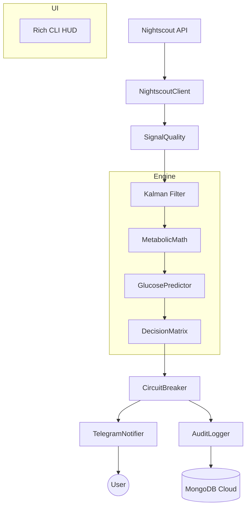

# Architecture: Bio-Quant Predictor v2.0

> Generated by /map on 2026-03-23

## Overview
Bio-Quant is a high-fidelity metabolic predictor designed to forecast hyperglycemia and faint risks using real-time CGM data from Nightscout. It employs a layered architecture separating signal processing, machine learning forecasting, and interactive alerting.

## System Diagram

## Components

### Ingestion (backend/src/ingestion/)
- **NightscoutClient**: Resilient bridge with exponential backoff.
- **SimReader**: Historical JSON replay for offline development.

### Signal Processing (backend/src/smoothing/)
- **GlucoseFilter**: Dual-state Kalman Filter (Glucose + Velocity).
- **SignalQuality**: Anomaly detection (Compression Lows, Gaps).

### Intelligence (backend/src/forecasting/ & backend/src/features/)
- **MetabolicMath**: Extraction of LBGI/HBGI and kinematic features.
- **GlucosePredictor**: XGBoost-powered 30-minute forecasting engine.

### Alerting (backend/src/alert_engine/)
- **DecisionMatrix**: Bimodal logic for hypo/hyper and faint risk.
- **CircuitBreaker**: Throttling to prevent alert fatigue.
- **TelegramNotifier**: Interactive HUD on user's phone.

## Data Flow
1. **Fetch**: `NightscoutClient` pulls raw SGV entries.
2. **Filter**: `KalmanFilter` produces smoothed state and velocity.
3. **Analyze**: `MetabolicMath` calculates risk indices (LBGI/HBGI).
4. **Predict**: `XGBoost` projects glucose 30 minutes forward.
5. **Decide**: `DecisionMatrix` evaluates risk vs. thresholds.
6. **Dispatch**: `TelegramNotifier` sends alert; `AuditLogger` persists to Mongo.

## Integration Points
| External Service | Type | Purpose |
|------------------|------|---------|
| Nightscout | REST API | Real-time CGM data source |
| Telegram | Bot API | Alert delivery and user feedback |
| MongoDB Atlas | NoSQL | Persistent medical audit logs |

## Conventions
- **Naming**: Absolute imports (`backend.src.X`).
- **Structure**: Domain-driven directory nesting.
- **Verification**: Automatic GSD summaries per phase.

## Technical Debt
- [ ] Implement `RECOVERY_MODE` for long sensor dropouts.
- [ ] Add `pydantic-settings` validation for all .env variables.
