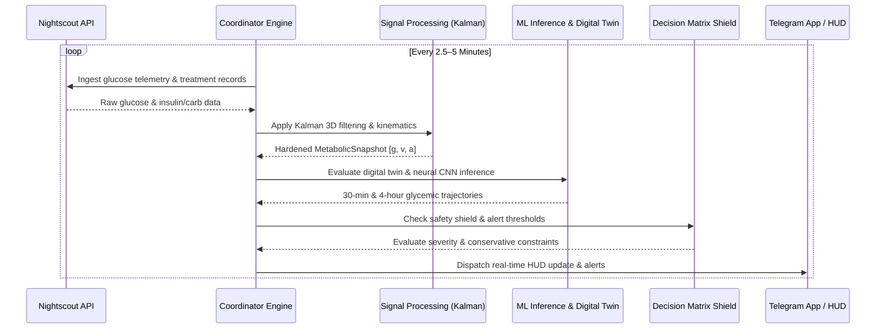

# Bio-Quant Metabolic Intelligence Engine

Real-time physiological monitoring, glucose trend forecasting, and faint-risk detection system for Type 1 Diabetes (T1D) management. Integrates Continuous Glucose Monitor (CGM) telemetry, digital twin simulation, and multi-layer neural inference to project metabolic trajectories and issue early warnings for glycemic emergencies.

---

## Architecture

A 5-layer model isolates physiological, environmental, behavioral, model-residual, and feedback signals.

| Layer | Domain | Responsibility | Key Inputs |
|---|---|---|---|
| 1 | Bio-Basal Vessel | Baseline physiological state | Glucose (g), rate of change (v), acceleration (a), heart rate, age, gender |
| 2 | Adaptive Regimes | Environmental/biological oscillations | Ambient temperature, humidity, AQI, circadian & hormonal cycles |
| 3 | Behavioral Engine | User-initiated interventions | Dietary carbs (GI/GL), active insulin (IOB), sleep, exercise |
| 4 | Meta-Correction | Systemic error tracking, sensor health | Model residuals, sensor jitter, metabolic inertia, confidence index |
| 5 | Interaction & RLHF | Subjective feedback, sensitivity tuning | Alarm feedback (RLHF), symptom logs, alert threshold customization |

---

## Execution Pipeline



---

## Repository Structure

```text
├── diabetic/                 # Core Python backend engine
│   ├── auth/                 # Telegram WebApp initData HMAC authentication
│   ├── cli/                  # CLI and TUI dispatchers
│   ├── dsp/                  # Kalman filtering, signal quality, metabolic math
│   ├── ingestion/            # Data source adapters (Nightscout, MongoDB, Weather)
│   ├── mcp/                  # FastMCP server exposing bio-quant diagnostic tools
│   ├── ml_engine/             # PyTorch 1D-CNN, Digital Twin, Basal Oracle, training
│   ├── storage/              # VesselRegistry (SQLAlchemy async), MongoDB clients
│   ├── telegram_bot/         # Decision matrix, alert dispatching, TWA API bridge
│   └── utils/                # Health probes, audit logging, data factory
├── docs/                     # Technical specifications and runbooks
│   ├── architecture.md       # System architecture specification
│   ├── data-provenance.md    # Historical data archives, CSV roles, verification
│   ├── history.md            # Legacy documentation archive, Git history
│   ├── local-nightscout.md   # Nightscout & MongoDB deployment runbook
│   ├── ML_SPEC.md            # Multi-layer metabolic model specification
│   └── engineering/          # Web app auth, API specs, TUI feature maps
├── ops/lab/                  # Unit and contract test suite
├── scripts/                  # Operations, migrations, offline verification tools
└── twa/                      # Telegram Mini App frontend (HTML/CSS/JS)
```

---

## Quick Start

### Prerequisites
- Python 3.12 (CPython 3.12.13 verified)
- MongoDB (optional, local or Atlas) and SQLite (async)

### Local Environment

```bash
python3.12 -m venv .venv
source .venv/bin/activate

pip install --upgrade pip
pip install --extra-index-url https://download.pytorch.org/whl/cpu -r requirements.txt
```

### Verification & Tests

```bash
# Full contract test suite
python -m pytest ops/lab -v

# Local simulation mode
python -m diabetic.main simulation

# System health status
python -m diabetic.main health
```

---

## Container Deployment

```bash
cp .env.example .env
docker compose up -d --build
docker compose ps
```

See the [Local Nightscout Runbook](docs/local-nightscout.md) for LAN binding, migration workflows, and backup procedures.

---

## Documentation Map

| Doc | Description |
|---|---|
| [System Architecture](docs/architecture.md) | Module wiring, sequence diagrams, formulas |
| [Metabolic ML Specification](docs/ML_SPEC.md) | Theoretical foundation for the 5-layer model |
| [Web Auth & API Spec](docs/engineering/architecture.md) | HMAC auth flow, endpoint maps, security contracts |
| [Data Provenance & Verification](docs/data-provenance.md) | Provenance contracts, archives, privacy guidelines |
| [Local Nightscout Runbook](docs/local-nightscout.md) | Operator guide for local container deployments |
| [Workspace Handoff](workspace/HANDOFF.md) | Verification state, remaining deployment gates |

---

## Security & Medical Disclaimer

- **Security**: All `/api/v1/*` endpoints are protected by Telegram WebApp `initData` HMAC validation with fail-closed authorization.
- **Medical**: Bio-Quant is an analytical decision-support tool. It does not issue insulin dosing commands to automated pumps and does not replace clinical medical advice.
