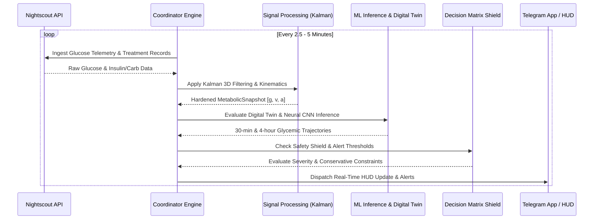

# Bio-Quant Metabolic Intelligence Engine

Institutional-grade physiological monitoring, continuous glucose trend forecasting, physical-chemical digital twin simulation, and neural faint risk prediction for Type 1 Diabetes (T1D) management.

Documentation: https://vgbn2.github.io/diabetic/

---

## One-Step Installation & Verification

Run the automated setup script to configure the environment, install all dependencies, and verify system cleanliness:

```bash
# Clone repository and execute one-step setup
git clone https://github.com/vgbn2/diabetic.git
cd diabetic
./scripts/setup.sh
```

### Manual Installation

```bash
# 1. Environment and dependencies
python3 -m venv .venv
source .venv/bin/activate
pip install -r requirements.txt -r requirements-dev.txt

# 2. Environment configuration
cp .env.example .env

# 3. Cleanliness and contract verification
python scripts/check_repo_cleanliness.py
```

---

## Core System Invariants

1. **Fail-Closed Safety Invariant**: Missing telemetry, sensor detachment, or neural network divergence forces the prediction pipeline to abort automated deep forecasts and revert immediately to physical-chemical kinematic modeling.
2. **Single-Claim Startup Authority**: Exactly one coordinator process may run at any time. An atomic POSIX PID file lock (`diabetic.lock`) prevents multiple pollers from creating split-brain state or overlapping alert dispatches.
3. **Strict Presentation Unit Authority**: Internal state and calculations operate solely in **mmol/L**. The `diabetic.ui.glucose_display` module is the single presentation authority for formatting values into mg/dL or mmol/L for user interfaces.
4. **Alpha Gate Confidence Pre-Conditioning**: Historical confidence ($C_k$) is smoothed and evaluated *before* Alpha Gate checks, eliminating uninitialized confidence index anomalies.
5. **Zero-Stub Engineering**: All registered CLI commands, MCP tools, and REST endpoints route to fully realized operational handlers with zero placeholders.

---

## 5-Layer Intelligence Hierarchy

| Layer | Domain | Responsibility | Key Input Signals |
|---|---|---|---|
| **Layer 1** | **Bio-Basal Vessel** | Baseline physiological state and telemetry | Glucose ($g$), Rate of Change ($v$), Acceleration ($a$), Heart Rate (BPM), Age, Gender |
| **Layer 2** | **Adaptive Regimes** | Forced environmental and biological oscillations | Ambient Temperature, Humidity, AQI, Circadian & Hormonal Cycles |
| **Layer 3** | **Behavioral Engine** | User-initiated metabolic interventions | Dietary Carbohydrates (GI/GL), Active Insulin (IOB), Sleep Duration, Physical Exercise |
| **Layer 4** | **Meta-Correction** | Systemic error tracking and sensor health | Model Residuals, Sensor Jitter, Metabolic Inertia, Confidence Score Index |
| **Layer 5** | **Interaction & RLHF** | Subjective feedback and sensitivity tuning | User Alarm Feedback (RLHF), Symptom Logs, Alert Threshold Customization |

---

## Operational Data Flow



---

## Repository Structure

```text
├── diabetic/                 # Core Python backend engine
│   ├── auth/                 # Telegram WebApp initData HMAC authentication
│   ├── cli/                  # Command-line interface and TUI dispatchers
│   ├── dsp/                  # Kalman filtering, signal quality, metabolic math
│   ├── ingestion/            # Data source adapters (Nightscout, MongoDB, Weather)
│   ├── mcp/                  # FastMCP server exposing bio-quant diagnostic tools
│   ├── ml_engine/            # PyTorch 1D-CNN, Digital Twin, Basal Oracle, Training
│   ├── operations/           # Bounded data retention cleanup operations
│   ├── storage/              # VesselRegistry (SQLAlchemy async) and MongoDB clients
│   ├── telegram_bot/         # Decision matrix, alert dispatching, TWA API bridge
│   └── ui/                   # Glucose display unit authority and terminal HUD
├── docs/                     # MkDocs documentation suite (Diataxis framework)
├── ops/lab/                  # Unit, contract, and lifecycle test suite
├── scripts/                  # Cleanliness evaluators, setup, and maintenance tools
└── twa/                      # Telegram Mini App frontend (Canvas HUD)
```

---

## Service Deployment (Docker Compose)

Launch the complete local stack comprising MongoDB, Nightscout, and the Bio-Quant Core engine:

```bash
# Start all containerized services
docker compose up -d

# View core logs
docker compose logs -f bio-quant-core

# Verify health status
docker compose ps
```

---

## CLI & Testing Commands

```bash
# Start live monitoring daemon directly on host
python -m diabetic.main live --port 8000

# Execute full contract test suite
pytest -q ops/lab/ tests/

# Run repository cleanliness evaluator
python scripts/check_repo_cleanliness.py

# Build and serve documentation locally
mkdocs serve
```

---

## Security & Medical Disclaimers

- **Security Policy**: All web API endpoints (`/api/v1/*`) require token or HMAC authentication with fail-closed authorization.
- **Medical Disclaimer**: The Bio-Quant engine is designed as an analytical decision-support tool. It does not issue direct insulin dosing commands to automated pumps or replace professional medical advice.
