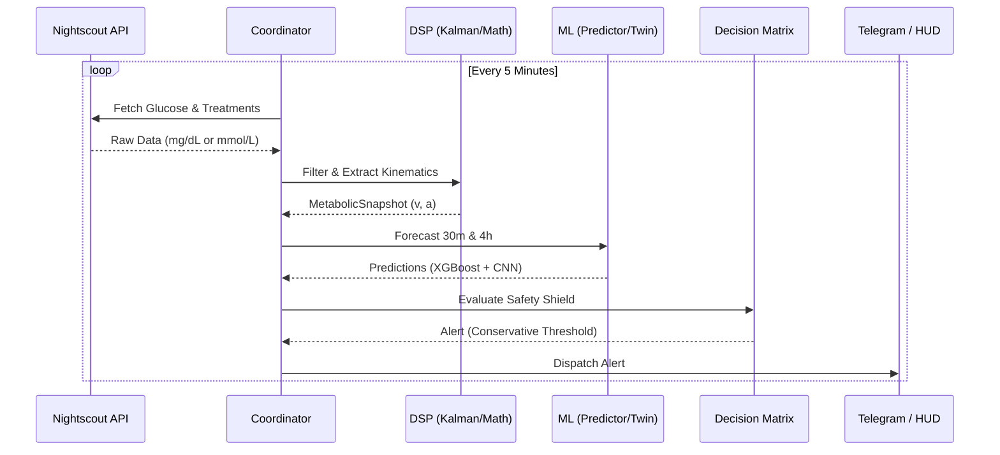

# Diabetic: Project Architecture

## 🎯 System Objective
**Diabetic** is a premium metabolic intelligence engine designed to eliminate unpredictability in Type 1 Diabetes management. It leverages a high-fidelity **Digital Twin** and a **5-Layer Intelligence Model** to proactively identify faint risks and glycemic instability before they occur.

---

## 🏗️ The 5-Layer Intelligence Hierarchy
The core logic is structured to isolate specific biological and environmental variables:

1.  **Tier 1: The Vessel (Basal/Static)** — Age, BG, HR-BPM, BMI, Ethnicity. The physiological foundation.
2.  **Tier 2: The Conditions (Environment/Cycles)** — Weather, AQI, Hormones, Seasonality. Uncontrollable oscillators.
3.  **Tier 3: The Choices (Behavioral)** — Diet, Drinks, Insulin, Sleep, Exercise. Human agency.
4.  **Tier 4: The Evaluation (Correction)** — Audit logs, Residual Error, Sensor Quality. Systemic self-awareness.
5.  **Tier 5: The Feedback (RLHF)** — Subjective symptoms and manual threshold bias.

---

## 🏗️ System Flow (Live Operations)
The system operates as a continuous polling loop, transforming raw sensor data into predictive alerts.

---

## 🧩 Module Deep-Dive

### 📂 [diabetic/](file:///c:/Users/Lenovo/Desktop/VGBN/.vscode/CODEPTIT/hyperglycemia-faint-predictor/diabetic/) (Core Logic)
- **[coordinator.py](file:///c:/Users/Lenovo/Desktop/VGBN/.vscode/CODEPTIT/hyperglycemia-faint-predictor/diabetic/coordinator.py)**: Manages concurrency and connects all sub-modules.
- **[registry.py](file:///c:/Users/Lenovo/Desktop/VGBN/.vscode/CODEPTIT/hyperglycemia-faint-predictor/diabetic/registry.py)**: Defines the **`MetabolicSnapshot`**, the unifying state object.

### 📂 [dsp/](file:///c:/Users/Lenovo/Desktop/VGBN/.vscode/CODEPTIT/hyperglycemia-faint-predictor/diabetic/dsp/) (Signal Hardening)
- **[kalman.py](file:///c:/Users/Lenovo/Desktop/VGBN/.vscode/CODEPTIT/hyperglycemia-faint-predictor/diabetic/dsp/kalman.py)**: Noise rejection logic for sensor artifacts (compression lows).
- **[signal_quality.py](file:///c:/Users/Lenovo/Desktop/VGBN/.vscode/CODEPTIT/hyperglycemia-faint-predictor/diabetic/dsp/signal_quality.py)**: Flags non-biological velocity spikes.

### 📂 [ml_engine/](file:///c:/Users/Lenovo/Desktop/VGBN/.vscode/CODEPTIT/hyperglycemia-faint-predictor/diabetic/ml_engine/) (Predictive Intelligence)
- **XGBoost (Tier 3)**: Models behavioral impact vectors (Meals/Insulin).
- **CNN (Tier 1 & 2)**: Detects high-frequency signal signatures in raw glucose traces.
- **Digital Twin**: Simulates the impact of meals using impulsive carb absorption math.

---

## 🔬 Math & Biology Specification

### 🧮 Mathematical Models
| Model / Formula | Purpose | Location |
| :--- | :--- | :--- |
| **Kalman 3D State** | Tracks $[g, v, a]$ | `dsp/kalman.py` |
| **Kovatchev Risk** | Transforms glucose into Risk Space | `dsp/metabolic_math.py` |
| **Kinematic PRED** | Linear projection fallback | `ml_engine/predictor.py` |
| **Impulse Response** | Carb absorption modeling | `ml_engine/twin.py` |

---

## 🚀 Forward Roadmap Summary
All detailed tasks are maintained in **[ROADMAP.md](file:///c:/Users/Lenovo/Desktop/VGBN/.vscode/CODEPTIT/hyperglycemia-faint-predictor/ROADMAP.md)**.
1. **The SQL Core**: Transition from CSV to multi-tenant SQL.
2. **CNN Layer**: Signal-shape recognition integration.
3. **RLHF Implementation**: Tier 5 feedback loop construction.
4. **Caregiver Escalation**: Logic to escalate alerts if a `CRITICAL_HYPO` is not acknowledged in 5 minutes.
