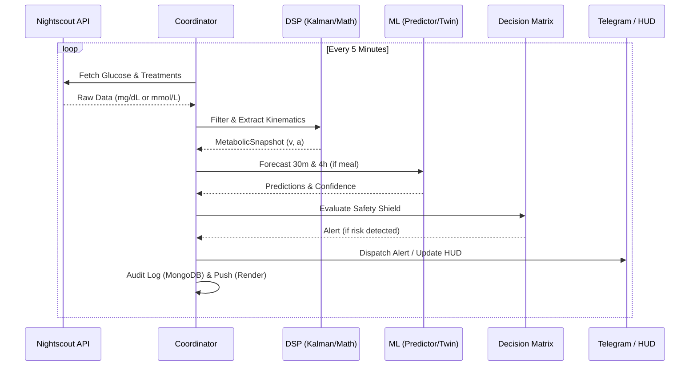

# Bio-Quant: Hyperglycemia Faint Predictor Architecture

## 🎯 System Objective
Bio-Quant is a high-availability metabolic monitoring engine designed to prevent fainting in Type 1 Diabetes patients. It specializes in detecting **non-physiological hyperglycemic climbs** and **rapid hypoglycemic crashes** using a combination of Kalman Filtering, Digital Twin simulation, and XGBoost-based forecasting.

---

## 🏗️ System Flow
The system operates as a continuous polling loop, transforming raw sensor data into predictive alerts.

---

## 🧩 Module Deep-Dive

### 📂 [diabetic/](file:///c:/Users/Lenovo/Desktop/VGBN/.vscode/CODEPTIT/hyperglycemia-faint-predictor/diabetic/) (Core Logic)
- **[coordinator.py](file:///c:/Users/Lenovo/Desktop/VGBN/.vscode/CODEPTIT/hyperglycemia-faint-predictor/diabetic/coordinator.py)**: The brain. Manages concurrency and connects all sub-modules. It maintains a moving window of `snapshots` to prevent memory leaks.
- **[registry.py](file:///c:/Users/Lenovo/Desktop/VGBN/.vscode/CODEPTIT/hyperglycemia-faint-predictor/diabetic/registry.py)**: Defines the **`MetabolicSnapshot`**, the unifying state object containing raw data, filtered values, velocity, and cardiac context.
- **[medical_constants.py](file:///c:/Users/Lenovo/Desktop/VGBN/.vscode/CODEPTIT/hyperglycemia-faint-predictor/diabetic/medical_constants.py)**: Hardcoded clinical boundaries (e.g., `FAINT_VELOCITY = 0.5 mmol/L/min`).

### 📂 [dsp/](file:///c:/Users/Lenovo/Desktop/VGBN/.vscode/CODEPTIT/hyperglycemia-faint-predictor/diabetic/dsp/) (Signal Hardening)
- **Kalman Innovation Clamping**: In [kalman.py](file:///c:/Users/Lenovo/Desktop/VGBN/.vscode/CODEPTIT/hyperglycemia-faint-predictor/diabetic/dsp/kalman.py), a 3-sigma clamping logic rejects sensor noise (like compression lows) by limiting how much the filter can jump in one step.
- **Fallacy Detection**: [signal_quality.py](file:///c:/Users/Lenovo/Desktop/VGBN/.vscode/CODEPTIT/hyperglycemia-faint-predictor/diabetic/dsp/signal_quality.py) immediately flags $v < -1.0$ mmol/L/min as a sensor artifact, as human biology rarely crashes that fast without external insulin intervention.

### 📂 [ml_engine/](file:///c:/Users/Lenovo/Desktop/VGBN/.vscode/CODEPTIT/hyperglycemia-faint-predictor/diabetic/ml_engine/) (Predictive Intelligence)
- **XGBoost Predictor**: [predictor.py](file:///c:/Users/Lenovo/Desktop/VGBN/.vscode/CODEPTIT/hyperglycemia-faint-predictor/diabetic/ml_engine/predictor.py) extracts a 10-dimensional feature vector, including circadian sine/cosine and metabolic momentum. Fallback is a physics-based Kinematic model.
- **Digital Twin**: [twin.py](file:///c:/Users/Lenovo/Desktop/VGBN/.vscode/CODEPTIT/hyperglycemia-faint-predictor/diabetic/ml_engine/twin.py) simulates the impact of meals. It uses an **Auto-Tune Feedback Loop** that adjusts Carbohydrate Sensitivity ($CSF$) by comparing predicted vs. actual values after a 4-hour window.

### 📂 [telegram_bot/](file:///c:/Users/Lenovo/Desktop/VGBN/.vscode/CODEPTIT/hyperglycemia-faint-predictor/diabetic/telegram_bot/) (Interaction)
- **Decision Matrix**: Evaluates state against cardiac stress (HR/HRV) and dawn phenomenon damping.
- **Circuit Breaker**: Prevents alert fatigue with a 15-minute cooldown, except for **EMERGENCY** severity.

---

## 🔬 Math & Biology Specification

### 🧮 Mathematical Models
| Model / Formula | Purpose | Location (File / Function) |
| :--- | :--- | :--- |
| **Kalman 3D State** | Tracks $[g, v, a]$ where $g$ is glucose, $v$ is velocity, and $a$ is acceleration. | [kalman.py](file:///c:/Users/Lenovo/Desktop/VGBN/.vscode/CODEPTIT/hyperglycemia-faint-predictor/diabetic/dsp/kalman.py) / `GlucoseFilter.update` |
| **Kovatchev Risk** | Transforms glucose into Risk Space (LBGI/HBGI) via log-symmetrization. | [metabolic_math.py](file:///c:/Users/Lenovo/Desktop/VGBN/.vscode/CODEPTIT/hyperglycemia-faint-predictor/diabetic/dsp/metabolic_math.py) / `MetabolicMath.calculate_risk_indices` |
| **ATR (Volatility)** | Measures metabolic volatility using Average True Range over 14 samples. | [metabolic_math.py](file:///c:/Users/Lenovo/Desktop/VGBN/.vscode/CODEPTIT/hyperglycemia-faint-predictor/diabetic/dsp/metabolic_math.py) / `MetabolicMath.calculate_atr` |
| **Kinematic PRED** | $P = G + (V \times t) + (0.5 \times A \times t^2)$ with inertia damping. | [predictor.py](file:///c:/Users/Lenovo/Desktop/VGBN/.vscode/CODEPTIT/hyperglycemia-faint-predictor/diabetic/ml_engine/predictor.py) / `GlucoseForecaster.predict` |
| **Impulse Response** | $f(t) = \frac{t}{\tau} \times \exp(1 - \frac{t}{\tau})$; models carb absorption curves. | [twin.py](file:///c:/Users/Lenovo/Desktop/VGBN/.vscode/CODEPTIT/hyperglycemia-faint-predictor/diabetic/ml_engine/twin.py) / `DigitalTwin.simulate_carb_impact` |
| **Auto-Tune PID** | Adjusts $CSF$ using an error-ratio feedback loop $(G_{act} / G_{pred})$. | [twin.py](file:///c:/Users/Lenovo/Desktop/VGBN/.vscode/CODEPTIT/hyperglycemia-faint-predictor/diabetic/ml_engine/twin.py) / `DigitalTwin.auto_tune` |

### 🧬 Biological Variables & Thresholds
| Variable | Value / Threshold | Location (File / Function) |
| :--- | :--- | :--- |
| **HYPO_CRITICAL** | $2.5\text{ mmol/L}$ (Emergency cognitive impairment) | [constants.py](file:///c:/Users/Lenovo/Desktop/VGBN/.vscode/CODEPTIT/hyperglycemia-faint-predictor/diabetic/medical_constants.py) (Global) |
| **FAINT_GLUCOSE** | $>17.0\text{ mmol/L}$ (Risk boundary for syncope) | [constants.py](file:///c:/Users/Lenovo/Desktop/VGBN/.vscode/CODEPTIT/hyperglycemia-faint-predictor/diabetic/medical_constants.py) (Global) |
| **HYPER_CRITICAL** | $14.0\text{ mmol/L}$ (CRITICAL ketoacidosis risk) | [constants.py](file:///c:/Users/Lenovo/Desktop/VGBN/.vscode/CODEPTIT/hyperglycemia-faint-predictor/diabetic/medical_constants.py) (Global) |
| **PHYSIO_FLOOR** | $2.2\text{ mmol/L}$ (Absolute minimum survivable) | [constants.py](file:///c:/Users/Lenovo/Desktop/VGBN/.vscode/CODEPTIT/hyperglycemia-faint-predictor/diabetic/medical_constants.py) (Global) |
| **FAINT_VELOCITY** | $>0.1\text{ mmol/L/min}$ (Rapid climb artifact or risk) | [constants.py](file:///c:/Users/Lenovo/Desktop/VGBN/.vscode/CODEPTIT/hyperglycemia-faint-predictor/diabetic/medical_constants.py) (Global) |
| **PHYSIO_MAX_DROP** | $0.3\text{ mmol/L/min}$ (Max biological crash rate) | [constants.py](file:///c:/Users/Lenovo/Desktop/VGBN/.vscode/CODEPTIT/hyperglycemia-faint-predictor/diabetic/medical_constants.py) (Global) |
| **COMPRESSION_DROP** | $>0.4\text{ mmol/L/min}$ (Flagged as sensor noise) | [constants.py](file:///c:/Users/Lenovo/Desktop/VGBN/.vscode/CODEPTIT/hyperglycemia-faint-predictor/diabetic/medical_constants.py) (Global) |
| **KALMAN_NOISE** | $0.25$ (Variance for Ottai M8 Sensor) | [constants.py](file:///c:/Users/Lenovo/Desktop/VGBN/.vscode/CODEPTIT/hyperglycemia-faint-predictor/diabetic/medical_constants.py) (Global) |
| **CARB_SENSITIVITY** | $0.16$ (Default CSF seed for Twin) | [constants.py](file:///c:/Users/Lenovo/Desktop/VGBN/.vscode/CODEPTIT/hyperglycemia-faint-predictor/diabetic/medical_constants.py) (Global) |
| **REGIME_MULT** | $1.25$ (Luteal/Dawn Resistance factor) | [constants.py](file:///c:/Users/Lenovo/Desktop/VGBN/.vscode/CODEPTIT/hyperglycemia-faint-predictor/diabetic/medical_constants.py) (Global) |
| **Cardiac Stress** | $\text{HR} > 100\text{ bpm}$ or $\text{HRV} < 20\text{ ms}$ | [matrix.py](file:///c:/Users/Lenovo/Desktop/VGBN/.vscode/CODEPTIT/hyperglycemia-faint-predictor/diabetic/telegram_bot/decision_matrix.py) / `DecisionMatrix.evaluate` |
| **Carb Absorption** | $\tau_{liquid}=15\text{m}$, $\tau_{starch}=60\text{m}$ | [constants.py](file:///c:/Users/Lenovo/Desktop/VGBN/.vscode/CODEPTIT/hyperglycemia-faint-predictor/diabetic/medical_constants.py) (Global) |
| **Dawn Damping** | $4\text{ AM} - 8\text{ AM}$ (Metabolic morning resistance) | [matrix.py](file:///c:/Users/Lenovo/Desktop/VGBN/.vscode/CODEPTIT/hyperglycemia-faint-predictor/diabetic/telegram_bot/decision_matrix.py) / `DecisionMatrix.evaluate` |

---

## 🛠️ Operations Guide

### How to Run
1.  **Configure**: Ensure `.env` has valid `NIGHTSCOUT_URL` and `TELEGRAM_TOKEN`.
2.  **Live Feed**: `python -m diabetic.main live`
3.  **Simulate**: `python -m diabetic.main faint` (Injects a rapid rise to test alerts).

### Verification Roadmap
| Script | Target | Purpose |
| :--- | :--- | :--- |
| `verify_ingestion.py` | [NightscoutClient](file:///c:/Users/Lenovo/Desktop/VGBN/.vscode/CODEPTIT/hyperglycemia-faint-predictor/diabetic/ingestion/nightscout.py) | Unit scales and retry logic. |
| `verify_kalman.py` | [GlucoseFilter](file:///c:/Users/Lenovo/Desktop/VGBN/.vscode/CODEPTIT/hyperglycemia-faint-predictor/diabetic/dsp/kalman.py) | Spike dampening and lag checks. |
| `verify_safety.py` | [DecisionMatrix](file:///c:/Users/Lenovo/Desktop/VGBN/.vscode/CODEPTIT/hyperglycemia-faint-predictor/diabetic/telegram_bot/decision_matrix.py) | Emergency bypass & cooldown. |

---

## 🚀 Forward Roadmap ([DEFERRED] Tasks)
1.  **Metabolic Visualizer**: Re-enable `charts_visualize` to send 4h PDF/PNG projections via Telegram.
2.  **Hormonal Cycle Scaling**: Enhance `detect_regime` to auto-adjust `REGIME_SENSITIVITY_MULT` based on multi-day trends.
3.  **ML Retraining**: Implement a script to update `models/xgboost_v1.json` using historical audit logs from MongoDB.
4.  **Caregiver Handover**: Implement the logic to escalate alerts to `CAREGIVER_ID` if a `CRITICAL_HYPO` is not acknowledged in 5 minutes.
