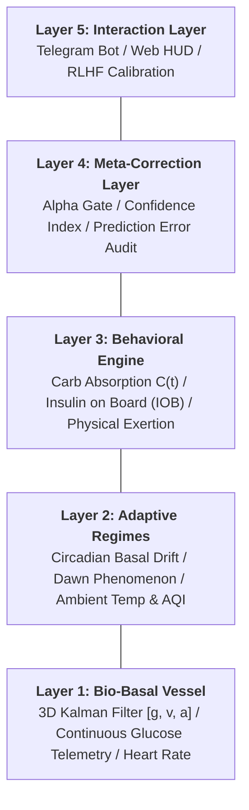
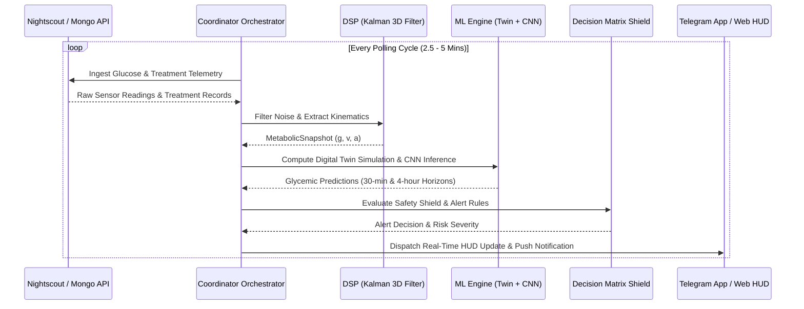

# Bio-Quant Architecture Summary

> **Diátaxis Type**: Orientation & Overview | **Status**: Canonical | **Review**: Continuous

The **Bio-Quant Engine** is an institutional-grade, real-time metabolic intelligence framework designed for Type 1 Diabetes management. It combines a physical-chemical digital twin simulation with data-driven neural inference (1D-CNN) to eliminate unpredictability, detect glycemic risk trajectories, and issue early warnings for impending faint risks.

---

## 5-Layer Intelligence Hierarchy

The architecture isolates metabolic variables into five distinct operational tiers:

1. **Layer 1: The Bio-Basal Vessel (Hardware & Basal Telemetry)**
   - Core biometrics: Blood Glucose ($g$), Velocity ($v$), Acceleration ($a$), Heart Rate (BPM), Age, Gender, Ethnicity.
   - Physiological baseline defining absolute survivable boundaries.

2. **Layer 2: The Adaptive Regimes (Environmental & Biological Oscillations)**
   - External forcings: Ambient temperature, AQI, indoor/outdoor attenuation.
   - Forced biological cycles: Dawn phenomenon, 24-hour circadian rhythms, hormonal resistance waves.

3. **Layer 3: The Behavioral Engine (Human Agency & Pharmacodynamics)**
   - Direct intervention tracking: Carbohydrate intake (GI/GL absorption profiles), active insulin (IOB/bolus), physical exertion, hydration.

4. **Layer 4: The Meta-Correction Layer (Self-Awareness & Error Tracking)**
   - Systemic audit: Residual prediction error tracking, sensor jitter analysis, metabolic inertia, and confidence score index calculation.

5. **Layer 5: The Interaction Layer (Interface & RLHF Calibration)**
   - Subjective feedback: Real-Time Reinforcement Learning from Human Feedback (RLHF), false alarm suppression, and customized user alert thresholds.

---

## Operational Data Flow

The continuous monitoring loop ingests telemetry every 2.5 to 5 minutes, hardens raw signals, projects future trajectories, and dispatches safety alerts.

---

## Subsystem Taxonomy & Load Indices

| Subsystem | Source Path | Core Role | Load Index | Memory Bound |
|---|---|---|---|---|
| **Coordinator Core** | `diabetic/coordinator.py` | Orchestration, lifecycle, task draining | 4 / 10 | RSS < 150 MB |
| **Ingestion Pipeline** | `diabetic/ingestion/` | Nightscout, Mongo, Weather, Event Integrity | 3 / 10 | RSS < 80 MB |
| **DSP Signal Processing** | `diabetic/dsp/` | 3D Kalman, Spike Rejection, Kovatchev Risk | 2 / 10 | Heap < 30 MB |
| **ML Engine & Twin** | `diabetic/ml_engine/` | Twin simulation, 1D-CNN, Forecasts, Promotion | 5 / 10 | RSS < 400 MB |
| **Decision & Alerting** | `diabetic/telegram_bot/` | Decision matrix, RLHF, Notifier | 2 / 10 | Heap < 40 MB |
| **Storage & Operations** | `diabetic/storage/`, `diabetic/operations/` | SQLAlchemy async engine, Vessel Registry, Retention | 2 / 10 | Heap < 50 MB |
| **Presentation & HUD** | `diabetic/ui/`, `twa/` | Unit authority formatting, CLI HUD, Web App | 2 / 10 | Browser DOM |

---

## Key Mathematical Formulas

| Transform | Mathematical Expression | Module Owner |
|---|---|---|
| **Kalman 3D State** | $\mathbf{x}_k = [g_k, v_k, a_k]^T, \quad \mathbf{x}_{k|k-1} = \mathbf{F} \mathbf{x}_{k-1}$ | `diabetic/dsp/kalman.py` |
| **Kovatchev Risk** | $f(g) = 1.509 \cdot (\ln(g)^{1.084} - 5.381), \quad LBGI = 10 \cdot f(g)^2 \text{ for } f(g) < 0$ | `diabetic/dsp/metabolic_math.py` |
| **Impulse Absorption** | $C(t) = \frac{t}{\tau^2} e^{-t/\tau}, \quad \Delta g(t) = \text{Carbs} \cdot S_{carb} \cdot C(t)$ | `diabetic/ml_engine/twin.py` |
| **Kinematic Fallback** | $g(t) = g_0 + v_0 t + \frac{1}{2} a_0 t^2$ | `diabetic/utils/data_factory.py` |
| **Alpha Gate Confidence** | $C_k = 0.8 \cdot C_{k-1} + 0.2 \cdot C_{raw}(H_{90m})$ | `diabetic/coordinator.py` |
