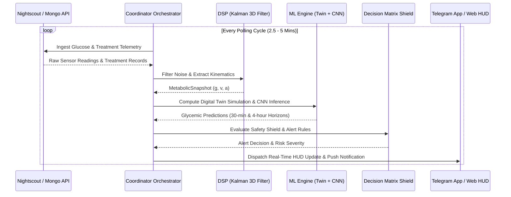

# Bio-Quant Engine Architecture

## 🎯 System Objective

The **Bio-Quant Engine** is a real-time metabolic intelligence framework designed for Type 1 Diabetes management. It combines physical-chemical digital twin simulation with data-driven neural inference to eliminate unpredictability, detect glycemic risk trajectories, and issue early warnings for impending faint risks.

---

## 🧬 5-Layer Intelligence Hierarchy

The architecture isolates variables into five distinct operational tiers:

1. **Layer 1: The Bio-Basal Vessel (Hardware & Basal Telemetry)**
   - Core biometrics: Blood Glucose ($g$), Velocity ($v$), Acceleration ($a$), Heart Rate (BPM), Age, Gender, Ethnicity.
   - Physiological baseline defining absolute survivable boundaries.

2. **Layer 2: The Adaptive Regimes (Environmental & Biological Oscillations)**
   - External forcings: Ambient temperature, AQI, indoor/outdoor attenuation.
   - Forced biological cycles: Dawn phenomenon, 24-hour circadian rhythms, 28-day hormonal resistance waves.

3. **Layer 3: The Behavioral Engine (Human Agency & Pharmacodynamics)**
   - Direct intervention tracking: Carbohydrate intake (GI/GL absorption profiles), active insulin (IOB/bolus), physical exertion, hydration.

4. **Layer 4: The Meta-Correction Layer (Self-Awareness & Error Tracking)**
   - Systemic audit: Residual prediction error tracking, sensor jitter analysis, metabolic inertia, and confidence score index calculation.

5. **Layer 5: The Interaction Layer (Interface & RLHF Calibration)**
   - Subjective feedback: Real-Time Reinforcement Learning from Human Feedback (RLHF), false alarm suppression, and customized user alert thresholds.

---

## 🏗️ Operational Data Flow

The continuous monitoring loop ingests telemetry every 2.5 to 5 minutes, hardens raw signals, projects future trajectories, and dispatches safety alerts.

---

## 🧩 Subsystem Architecture

### 1. Ingestion Adapters ([diabetic/ingestion/](../diabetic/ingestion/))
- **[nightscout.py](../diabetic/ingestion/nightscout.py)**: REST API adapter supporting header/query authentication and token fallback.
- **[mongo.py](../diabetic/ingestion/mongo.py)**: Async MongoDB client for local telemetry storage and historical reading retrieval.
- **[offline/historical.py](../diabetic/ingestion/offline/historical.py)**: High-resolution export parser for historical dataset reconstruction.

### 2. Signal Processing ([diabetic/dsp/](../diabetic/dsp/))
- **[kalman.py](../diabetic/dsp/kalman.py)**: 3D Kalman filter tracking state vector $[g, v, a]$ and rejecting noise artifacts.
- **[signal_quality.py](../diabetic/dsp/signal_quality.py)**: Non-biological velocity spike detection and sensor jitter analysis.
- **[metabolic_math.py](../diabetic/dsp/metabolic_math.py)**: Kovatchev risk-space transformation $[HBGI, LBGI, RI]$.

### 3. ML Engine & Forecasting ([diabetic/ml_engine/](../diabetic/ml_engine/))
- **[twin.py](../diabetic/ml_engine/twin.py)**: Physical-chemical digital twin implementing impulse-response meal absorption and insulin decay.
- **[inference.py](../diabetic/ml_engine/inference.py)**: PyTorch 1D-CNN inference runner with fail-closed weight verification.
- **[forecast.py](../diabetic/ml_engine/forecast.py)**: Multi-horizon projection engine generating 4-hour and 24-hour trajectories.
- **[oracle.py](../diabetic/ml_engine/oracle.py)**: Basal oracle estimating circadian basal drift patterns over 24-hour windows.

### 4. Alerting & Web Interface ([diabetic/telegram_bot/](../diabetic/telegram_bot/))
- **[decision_matrix.py](../diabetic/telegram_bot/decision_matrix.py)**: Conservative safety shield with RLHF dampening and velocity thresholds.
- **[twa_api.py](../diabetic/telegram_bot/twa_api.py)**: FastAPI web bridge serving real-time HUD and calibration endpoints.

---

## 🔬 Mathematical & Biological Specifications

| Model / Transform | Description & Formula | Primary Module |
| :--- | :--- | :--- |
| **Kalman 3D State** | State vector $\mathbf{x}_k = [g_k, v_k, a_k]^T$ with continuous transition | `diabetic/dsp/kalman.py` |
| **Kovatchev Risk** | $f(g) = 1.509 \cdot \left( \ln(g)^{1.084} - 5.381 \right)$ mapping glucose to symmetric risk space | `diabetic/dsp/metabolic_math.py` |
| **Impulse Absorption** | Biphasic carbohydrate absorption curve $C(t) = \frac{t}{\tau^2} e^{-t/\tau}$ | `diabetic/ml_engine/twin.py` |
| **Kinematic Fallback** | Linear-quadratic extrapolation $g(t) = g_0 + v_0 t + \frac{1}{2} a_0 t^2$ | `diabetic/utils/data_factory.py` |

---

## 📌 Implementation Verification & Governance

Refer to [workspace/HANDOFF.md](../workspace/HANDOFF.md) for current verified execution state, test baseline coverage, and deployment promotion prerequisites.
