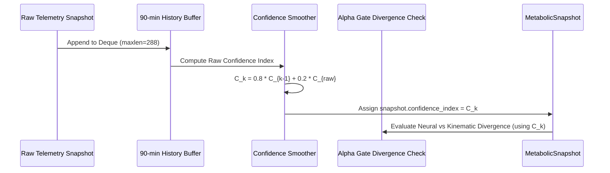

# Code Atlas: Alpha Gate Confidence Ordering

> **Diátaxis Type**: Code Atlas Record | **ID**: `ATLAS-PROTO-001` | **Owner**: `diabetic.coordinator`

---

## 1. Protocol Objective

Guarantees that the historical confidence index ($C_k$) is completely calculated, decayed, and smoothed *before* evaluating neural vs. physical-chemical divergence.

---

## 2. Sequence Invariant

