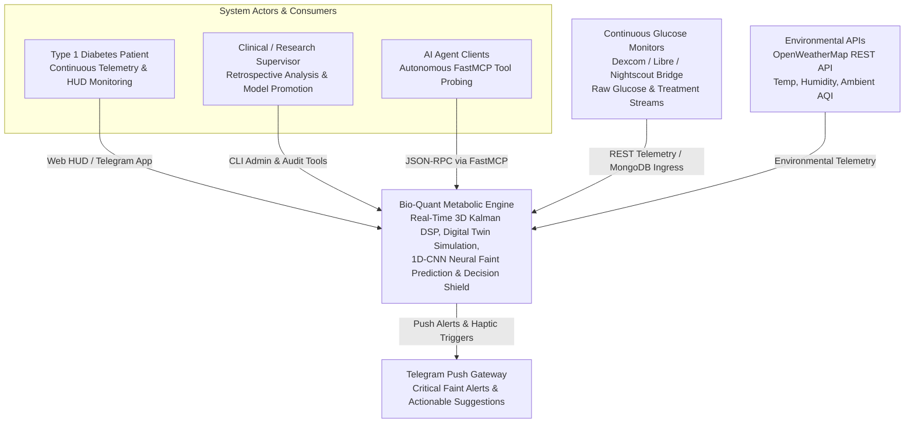
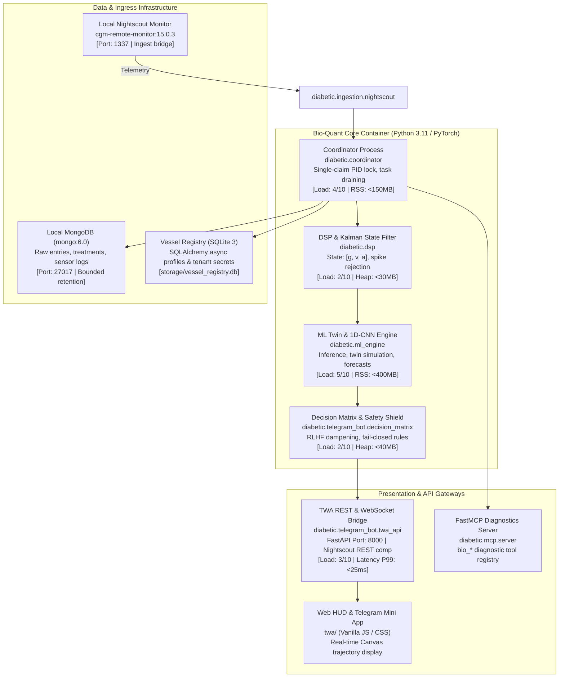
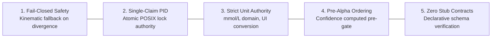

# 01. Bio-Quant Architecture & Codebase Organization

> **Diátaxis Type**: Explanation & Reference | **Status**: Canonical | **Review**: Continuous

This document establishes the canonical top-level architecture, subsystem boundaries, directory taxonomy, C4 container & component topologies, and fundamental runtime invariants for the Bio-Quant Metabolic Intelligence Platform.

---

## 1. Architectural Standards & Meta-Framework Synthesis

The Bio-Quant engineering documentation synthesizes four industry architectural standards:

| Framework | Core Focus | Integration Layer | Bio-Quant Platform Mapping |
|---|---|---|---|
| **ISO/IEC/IEEE 42010** | Architecture Description | Meta-Framework | Stakeholders, viewpoints, invariant guarantees |
| **arc42** | Structural Pattern | Document Sections | Context, building blocks, runtime, deployment, risks |
| **C4 Model** | Hierarchical Zoom | Diagrammatic Model | Context (L1), Containers (L2), Components (L3), Code |
| **Diátaxis** | Information Needs | Documentation Type | High-density "Explanation" + "Reference" synthesis |

---

## 2. C4 Architecture Topologies

### C4 Level 1: System Context Diagram

### C4 Level 2: Container Diagram (Inter-Process Topology)

---

## 3. Subsystem Boundaries & Directory Taxonomy

| Directory | Subsystem Role | Invariants & Constraints | Primary Entrypoint |
|---|---|---|---|
| `diabetic/` | Core Engine Package | Pure Python 3.11+, typed, zero-stub contracts | `diabetic/main.py` |
| `diabetic/coordinator.py` | Central Orchestration | Single-claim startup, background task draining | `Coordinator.start()` |
| `diabetic/ingestion/` | Multi-Source Ingress | Idempotent deduplication, watermarking | `EventIntegrity` |
| `diabetic/dsp/` | Signal Processing & Math | 3D Kalman $[g, v, a]$, Kovatchev Risk | `Kalman3DFilter` |
| `diabetic/ml_engine/` | Twin & Neural Forecaster | Fail-closed weight verification, atomic journal | `NeuralInferenceRunner` |
| `diabetic/telegram_bot/` | API, Alerting & Bot | Conservative safety shield, RLHF dampening | `twa_api.py`, `handlers.py` |
| `diabetic/ui/` | Presentation Layer | Strict unit authority (`glucose_display.py`) | `format_glucose()` |
| `diabetic/storage/` | Persistence & Tenancy | Async SQLAlchemy engine, clean shutdown | `DatabaseEngine` |
| `diabetic/operations/` | Data Hygiene & Retention | Pre/post audit validation, bounded batch delete | `cleanup_historical_retention` |
| `ops/lab/` | Contract Test Suite | Fast, zero-sleep unit and contract gates | `pytest ops/lab/` |
| `twa/` | Frontend Web App | Zero-build Vanilla JS, WebSocket auto-reconnect | `twa/index.html` |

---

## 4. Fundamental Runtime Invariants

1. **Fail-Closed Safety Invariant**: If neural inference diverges from physical-chemical digital twin kinematics by more than the threshold or if weights are corrupted, the engine immediately fails closed to the linear-quadratic kinematic projection.
2. **Single-Claim Startup Authority**: The coordinator acquires an exclusive file lock (`diabetic.lock`) and validates active PID status. If a duplicate process attempts startup, it terminates with POSIX exit code 1.
3. **Strict Presentation Unit Authority**: Internal state and calculations operate solely in **mmol/L**. The `diabetic.ui.glucose_display` module is the single presentation authority for formatting values into mg/dL or mmol/L for user interfaces.
4. **Alpha Gate Confidence Pre-Conditioning**: Historical confidence ($C_k$) is smoothed and evaluated *before* Alpha Gate checks, eliminating uninitialized confidence index anomalies.
5. **Zero-Stub Engineering**: All registered CLI commands, MCP tools, and REST endpoints route to fully realized operational handlers.
