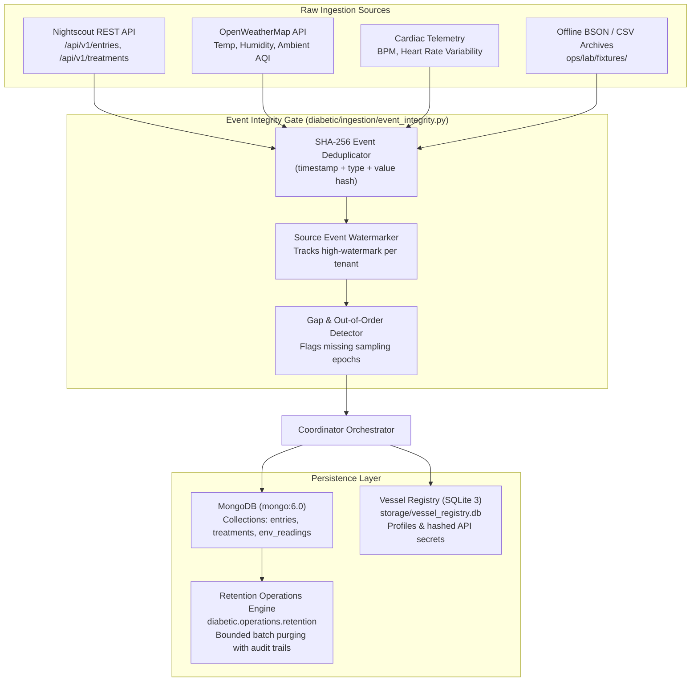

# 02. Ingestion Pipeline & Storage Architecture

> **Diátaxis Type**: Explanation & Reference | **Status**: Canonical | **Review**: Continuous

This document details the multi-source telemetry ingestion pipeline, idempotency deduplication, event watermarking, MongoDB persistence, and bounded retention operations for Bio-Quant.

---

## 1. Ingestion Pipeline Topology

The ingestion layer connects external hardware sensors (Dexcom, Libre via Nightscout), environmental data (OpenWeatherMap), cardiac telemetry (BPM monitors), and offline BSON archives into a unified, clean stream of physiological snapshots.



---

## 2. Event Integrity & Deduplication Protocol

To prevent duplicate entries caused by sensor retries, network polling overlaps, or backfill replays, every ingested event passes through `EventIntegrity`:

1. **Deterministic Event Fingerprinting**:
   $$\text{Hash} = \text{SHA256}(\text{source} \parallel \text{timestamp\_iso} \parallel \text{event\_type} \parallel \text{value})$$
2. **Sliding Memory Filter**: Maintains a bounded in-memory sliding window of the last $N = 10,000$ hashes ($O(1)$ lookup complexity).
3. **Temporal Watermarking**: Records the latest processed timestamp per stream. Late-arriving events older than the watermark trigger explicit out-of-order handling without corrupting live Kalman velocity tracking.

---

## 3. MongoDB Storage & Ingress Collection Schema

| Collection | Key Fields | Retention Policy | Indexing Strategy |
|---|---|---|---|
| `entries` | `date` (ms), `sgv` (mg/dL), `direction`, `type` | Default 90 days | `{ date: -1, type: 1 }` |
| `treatments` | `created_at`, `eventType`, `insulin`, `carbs` | Default 365 days | `{ created_at: -1 }` |
| `cardiac_readings` | `timestamp`, `heart_rate`, `provenance` | Default 30 days | `{ timestamp: -1 }` |
| `env_readings` | `timestamp`, `temperature`, `humidity`, `aqi` | Default 30 days | `{ timestamp: -1 }` |

---

## 4. Truthful Bounded Retention Operations

Data retention is managed by `diabetic.operations.retention`:

```python
async def cleanup_historical_retention(
    mongo_client: AsyncMongoClient,
    retention_days: int = 90,
    batch_size: int = 500,
    dry_run: bool = False
) -> RetentionResult:
    # 1. Pre-audit: Count candidate records older than cutoff
    # 2. Bounded deletion: Execute batched deletions (max batch_size) to prevent lock thrashing
    # 3. Post-audit: Verify integrity and return structured audit metrics
```

### Safety Guarantees
- **Audit-First**: Never deletes without pre-computation of targeted count.
- **Fail-Safe Dry Run**: Supports `--dry-run` flag in CLI and administrative MCP tools.
- **Bounded Lock Duration**: Deletes in chunked batches (500 records) to preserve MongoDB read throughput during active real-time monitoring.
