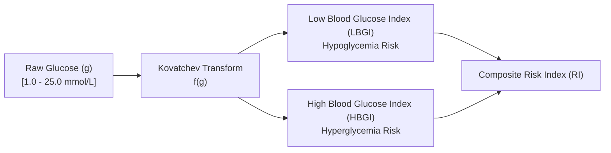

# 03. Signal Processing & 3D Kalman Filter

> **Diátaxis Type**: Explanation & Reference | **Status**: Canonical | **Review**: Continuous

This document covers the Digital Signal Processing (DSP) tier in Bio-Quant: 3D Kalman state estimation, sensor jitter attenuation, velocity spike rejection, and Kovatchev risk-space transformations.

---

## 1. 3D Kalman Filter Mathematical Formulation

The core signal estimator models physiological glucose kinetics as a 3-dimensional continuous-time kinematic system tracking position ($g$), velocity ($v = \dot{g}$), and acceleration ($a = \ddot{g}$):

$$\mathbf{x}_k = \begin{bmatrix} g_k \\ v_k \\ a_k \end{bmatrix} \in \mathbb{R}^3$$

### State Transition Matrix ($\mathbf{F}$) & Process Noise Covariance ($\mathbf{Q}$)
For a discrete sampling interval $\Delta t = 5 \text{ minutes}$:

$$\mathbf{F} = \begin{bmatrix} 1 & \Delta t & \frac{1}{2}\Delta t^2 \\ 0 & 1 & \Delta t \\ 0 & 0 & 1 \end{bmatrix}$$

$$\mathbf{Q} = q \cdot \begin{bmatrix} \frac{\Delta t^5}{20} & \frac{\Delta t^4}{8} & \frac{\Delta t^3}{6} \\ \frac{\Delta t^4}{8} & \frac{\Delta t^3}{3} & \frac{\Delta t^2}{2} \\ \frac{\Delta t^3}{6} & \frac{\Delta t^2}{2} & \Delta t \end{bmatrix}$$

### Measurement Model & Innovation
The continuous glucose monitor only measures blood glucose concentration ($g$):

$$\mathbf{H} = \begin{bmatrix} 1 & 0 & 0 \end{bmatrix}, \quad R = \sigma_{sensor}^2$$

$$\tilde{\mathbf{y}}_k = z_k - \mathbf{H} \hat{\mathbf{x}}_{k|k-1}$$

$$\mathbf{S}_k = \mathbf{H} \mathbf{P}_{k|k-1} \mathbf{H}^T + R$$

$$\mathbf{K}_k = \mathbf{P}_{k|k-1} \mathbf{H}^T \mathbf{S}_k^{-1}$$

$$\hat{\mathbf{x}}_{k|k} = \hat{\mathbf{x}}_{k|k-1} + \mathbf{K}_k \tilde{\mathbf{y}}_k$$

$$\mathbf{P}_{k|k} = (\mathbf{I} - \mathbf{K}_k \mathbf{H}) \mathbf{P}_{k|k-1}$$

> **Ponytail Resilience Invariant**: If $\mathbf{S}_k$ approaches singularity ($\det(\mathbf{S}_k) < 10^{-12}$), the filter falls back to Moore-Penrose pseudo-inversion (`np.linalg.pinv`) to prevent `LinAlgError` crashes during sensor connection transients.

---

## 2. Biological Velocity Spike & Jitter Rejection

Continuous glucose sensors occasionally suffer from compression lows, electrostatic discharge, or rapid interstitial fluid pressure shifts. The DSP pipeline applies biological acceleration bounds:

1. **Maximum Biological Velocity**: $|v| \le 0.35 \text{ mmol/L/min}$ ($6.3 \text{ mg/dL/min}$).
2. **Maximum Biological Acceleration**: $|a| \le 0.05 \text{ mmol/L/min}^2$.
3. **Artifact Flagging**: Readings exceeding physiological bounds trigger an increased sensor measurement variance ($R \leftarrow 10 \cdot R$), forcing the filter to rely on metabolic inertia until clean signals resume.

---

## 3. Kovatchev Risk-Space Transformation

Raw blood glucose measurements are logarithmically asymmetric: a drop from $5.0$ to $3.0 \text{ mmol/L}$ presents extreme immediate mortality risk, whereas an equivalent numerical rise from $5.0$ to $7.0 \text{ mmol/L}$ is clinically benign.

The Kovatchev transform projects glucose into a symmetric risk space:

$$f(g) = 1.509 \cdot \left( \ln(g)^{1.084} - 5.381 \right)$$

$$r(g) = 10 \cdot f(g)^2$$

$$\text{LBGI} = \begin{cases} r(g) & \text{if } f(g) < 0 \\ 0 & \text{otherwise} \end{cases}, \quad \text{HBGI} = \begin{cases} r(g) & \text{if } f(g) > 0 \\ 0 & \text{otherwise} \end{cases}$$

$$\text{Risk Index (RI)} = \text{LBGI} + \text{HBGI}$$

