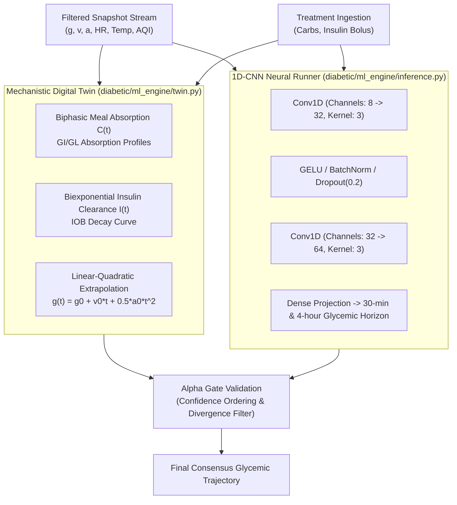
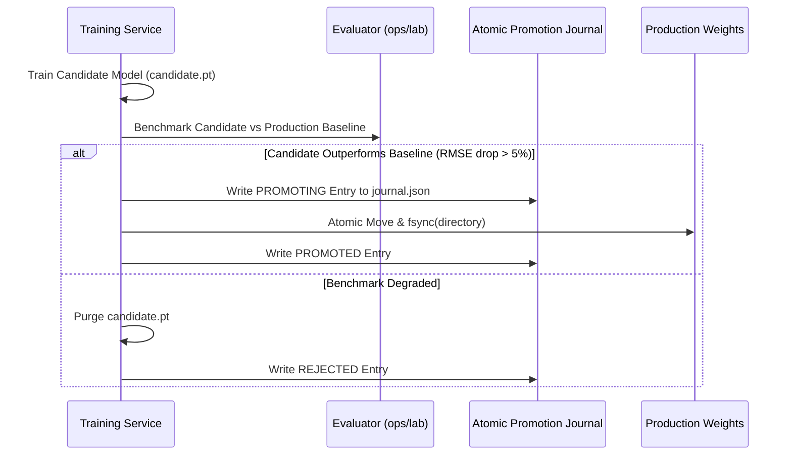

# 04. Neural Engine & Digital Twin Simulation

> **Diátaxis Type**: Explanation & Reference | **Status**: Canonical | **Review**: Continuous

This document details the hybrid physical-chemical digital twin, the 1D Convolutional Neural Network (1D-CNN) inference engine, the Basal Oracle, and atomic model candidate promotion.

---

## 1. Dual-Core Prediction Architecture

Bio-Quant employs a hybrid prediction architecture combining mechanistic differential equation modeling (Digital Twin) with deep empirical sequence modeling (1D-CNN):

---

## 2. Mechanistic Digital Twin Dynamics

### Biphasic Carbohydrate Absorption ($C(t)$)
The rate of glucose appearance from consumed carbohydrates is modeled by an impulse-response curve parameterized by the absorption time constant $\tau$:

$$C(t) = \frac{t}{\tau^2} e^{-t/\tau}, \quad \int_0^\infty C(t) dt = 1$$

$$\Delta g_{carb}(t) = \text{Carbs (g)} \cdot S_{carb} \cdot C(t)$$

Where $S_{carb}$ is the patient-specific Carbohydrate Sensitivity Factor ($\text{mmol/L per gram}$).

### Insulin Action & Decay ($I(t)$)
Rapid-acting insulin pharmacodynamics follow a biexponential clearance curve:

$$I(t) = \frac{S_{ins}}{\tau_2 - \tau_1} \left( e^{-t/\tau_2} - e^{-t/\tau_1} \right)$$

Where $S_{ins}$ is the Insulin Sensitivity Factor (ISF), $\tau_1 \approx 50 \text{ min}$ (action peak), and $\tau_2 \approx 120 \text{ min}$ (clearance tail).

---

## 3. Basal Drift Oracle

Circadian variations (dawn phenomenon, hormonal cortisol peaks) cause baseline glycemic drift independent of food and boluses. The Basal Oracle fits a 24-hour sinusoidal harmonic series over 7-day historical windows:

$$g_{basal}(t_{tod}) = g_{base} + A_1 \cos\left(\frac{2\pi t_{tod}}{24} + \phi_1\right) + A_2 \cos\left(\frac{4\pi t_{tod}}{24} + \phi_2\right)$$

---

## 4. Model Candidate Promotion Journal

The continuous retraining service (`diabetic/ml_engine/training_service.py`) adheres to strict atomic promotion and rollback guarantees:

### Safety Guarantees
- **Atomic fsync**: All weight files are synchronized to non-volatile disk before updating the active pointer.
- **Fail-Safe Rollback**: If corruption or tensor dimension mismatch is detected at load time, the runtime automatically rolls back to the last known stable checkpoint.
