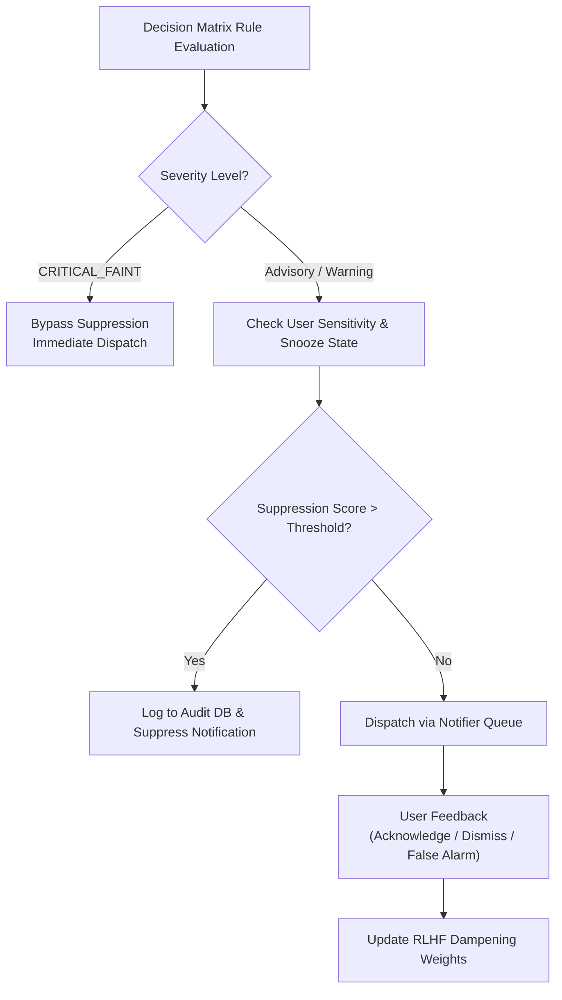

# 05. Decision Matrix & Alert Dispatch

> **Diátaxis Type**: Explanation & Reference | **Status**: Canonical | **Review**: Continuous

This document details the clinical decision matrix, the RLHF alert suppression system, rate limiting, and Telegram/TWA notification dispatch.

---

## 1. Safety Shield & Decision Rules

The Decision Matrix evaluates filtered kinematics ($g, v, a$), predicted 30-minute trajectories ($g_{30m}$), and cardiac response to classify real-time metabolic states:

| Risk Level | Trigger Condition | Clinical Definition | Automated Action |
|---|---|---|---|
| **CRITICAL_FAINT** | $g < 3.5 \text{ mmol/L} \land v < -0.15 \text{ mmol/L/min}$ | Impending neuroglycopenic faint | Priority alert + Haptic alarm |
| **URGENT_LOW** | $g < 3.9 \text{ mmol/L}$ | Severe hypoglycemia threshold | Push notification + Fast-acting carbs prompt |
| **RAPID_FALL** | $v < -0.18 \text{ mmol/L/min}$ ($3.2 \text{ mg/dL/min}$) | Precipitous glycemic drop | Warning alert + IOB review |
| **RAPID_RISE** | $v > +0.20 \text{ mmol/L/min}$ ($3.6 \text{ mg/dL/min}$) | Unchecked glycemic spike | Advisory + Correction suggestion |
| **HIGH_GLUCOSE** | $g > 13.9 \text{ mmol/L}$ | Sustained hyperglycemia | Hyperglycemic advisory |
| **NOMINAL** | $3.9 \le g \le 10.0 \text{ mmol/L}$ | Target Euglycemic Range | Silent HUD update |

---

## 2. RLHF Alert Fatigue Suppression

Alert fatigue is a critical safety risk in chronic diabetes management. Bio-Quant implements subjective feedback dampening via Reinforcement Learning from Human Feedback (RLHF):

---

## 3. Notifier Lifecycle & Background Task Draining

Notification delivery is managed by `diabetic.telegram_bot.notifier`:

1. **Non-Blocking Queue**: Alerts are pushed to an async `asyncio.Queue` to prevent blocking the real-time coordinator loop.
2. **Rate Limiting & De-Duplication**: Prevents alert storms by enforcing minimum quiet windows (15 minutes for repeated identical warnings).
3. **Graceful Task Draining**: On coordinator shutdown, active alert queues are flushed and drained with an explicit timeout before process exit.
