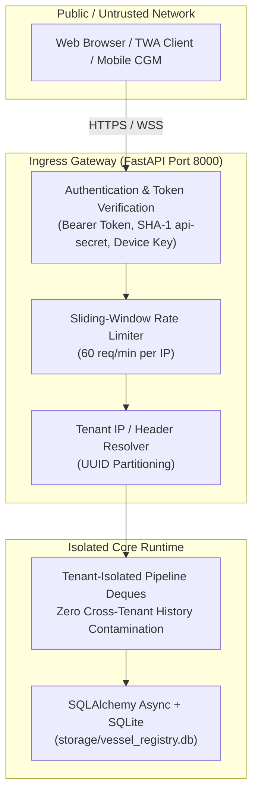

# 06. Security, Ingress & Multi-Tenant Architecture

> **Diátaxis Type**: Explanation & Reference | **Status**: Canonical | **Review**: Continuous

This document establishes the security architecture, REST & WebSocket ingress protocols, Nightscout API authentication compatibility, and multi-tenant isolation roadmap.

---

## 1. Multi-Tier Security Boundary



---

## 2. Nightscout API Compatibility & Ingress Endpoints

The FastAPI bridge (`diabetic.telegram_bot.twa_api`) provides complete backwards compatibility with Nightscout REST specifications:

| Route | Method | Purpose | Authentication |
|---|---|---|---|
| `/api/v1/entries` | `GET`, `POST` | Ingest CGM sensor telemetry, query historical entries | `api-secret` SHA-1 / Token |
| `/api/v1/treatments` | `GET`, `POST` | Ingest insulin bolus and carb intake | `api-secret` SHA-1 / Token |
| `/api/v1/status.json` | `GET` | Health check and server status | Optional / Public |
| `/api/v1/cgm_config` | `GET` | Tenant device configuration & polling intervals | Device Secret |
| `/api/v1/hud/live` | `GET`, `WS` | Real-time Canvas HUD state stream | Session Cookie / Token |

---

## 3. Multi-Tenant Pipeline Isolation

To support multi-patient tracking without data contamination, the coordinator enforces tenant-level history separation:

```python
class TenantPipeline:
    def __init__(self, tenant_id: str):
        self.tenant_id = tenant_id
        self.snapshots = deque(maxlen=288)  # 24-hour history
        self.kalman = Kalman3DFilter()
        self.confidence_smoothed: Optional[float] = None
```

### Invariants
1. **Zero History Bleed**: Feature calculation, ATR-14, and Kovatchev risk transforms evaluate solely against the tenant-specific snapshot deque.
2. **Distinct Device Secrets**: Each patient profile in `VesselRegistry` maintains independent SHA-256 password/device hashes.
3. **Fail-Closed Routing**: Ingress telemetry without a valid tenant header or known device secret is rejected with `401 Unauthorized`.
