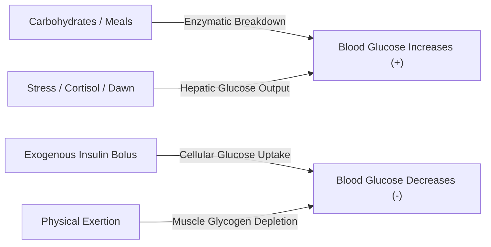

# 07. Clinical & Metabolic Primer for Systems Engineers

> **Diátaxis Type**: Explanation & Reference | **Status**: Canonical | **Review**: Continuous

This document bridges physiological principles and software engineering semantics for developers maintaining the Bio-Quant platform.

---

## 1. Core Endocrine Mechanics

In healthy physiology, the pancreas continuously modulates insulin and glucagon secretion to maintain euglycemia ($4.0 - 7.8 \text{ mmol/L}$ / $72 - 140 \text{ mg/dL}$). 

In Type 1 Diabetes (T1D), autoimmune destruction of pancreatic beta cells permanently eliminates endogenous insulin production. Patients must manually estimate and inject exogenous insulin to match carbohydrate absorption, basal metabolic demand, and physical exertion.

---

## 2. Glycemic Units & Strict Authority Invariant

Two primary units are used globally for blood glucose measurement:

1. **$\text{mmol/L}$ (Millimoles per liter)**: International standard (SI unit), molar concentration of glucose in blood plasma.
2. **$\text{mg/dL}$ (Milligrams per deciliter)**: Traditional mass concentration unit (predominant in the US and parts of Asia).

### Conversion Constant
$$1 \text{ mmol/L} = 18.0182 \text{ mg/dL} \approx 18.0 \text{ mg/dL}$$

$$g_{\text{mg/dL}} = g_{\text{mmol/L}} \times 18.0182$$

### Strict Domain Authority Rule
- All internal computations, Kalman state vectors, risk matrices, and neural inputs use **$\text{mmol/L}$**.
- Conversions to $\text{mg/dL}$ take place exclusively at presentation time in `diabetic.ui.glucose_display`.

---

## 3. Neuroglycopenic Faint Risk & Kinematics

When blood glucose drops below $3.5 \text{ mmol/L}$ with a high negative velocity ($v < -0.15 \text{ mmol/L/min}$), cerebral glucose supply becomes insufficient to maintain consciousness, leading to sudden neuroglycopenic syncope (fainting).

Bio-Quant calculates Time-to-Faint ($TTF$):

$$TTF = \frac{g_0 - g_{faint}}{|v_0|} \quad \text{for } v_0 < 0, \; g_{faint} = 3.0 \text{ mmol/L}$$

When $TTF \le 15 \text{ minutes}$, the engine triggers high-priority visual and haptic alarms to prompt immediate intake of rapid-acting carbohydrates (15g glucose tablets/juice).
