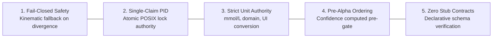

# Product Specification

> **Diátaxis Type**: Reference & Specification | **Status**: Canonical | **Owner**: Platform Engineering | **Review**: Continuous

---

## 1. Mission Statement

The **Bio-Quant Metabolic Intelligence Platform** delivers institutional-grade, real-time physiological monitoring, physical-chemical digital twin modeling, and neural faint risk prediction for Type 1 Diabetes management.

It eliminates metabolic unpredictability by fusing multi-source telemetry (continuous glucose monitoring, cardiac metrics, environmental forcings, and treatment records) into a fail-closed predictive safety shield.

---

## 2. Five Core Architectural Invariants

### Invariant 1: Fail-Closed Operations
Missing telemetry, sensor detachment, or neural network divergence forces the prediction pipeline to abort automated deep forecasts and revert immediately to physical-chemical kinematic modeling.

### Invariant 2: Single-Claim Startup Authority
Only one coordinator instance may run at any time. An atomic POSIX PID file lock (`diabetic.lock`) prevents multiple pollers from creating split-brain state or overlapping alert dispatches.

### Invariant 3: Strict Presentation Unit Authority
All internal data structures, mathematical models, and database records store blood glucose strictly in **mmol/L**. The presentation module (`diabetic.ui.glucose_display`) serves as the sole conversion authority for user-facing displays.

### Invariant 4: Alpha Gate Confidence Pre-Conditioning
The historical confidence index ($C_k$) is smoothed and pre-computed over the 90-minute historical horizon before evaluating divergence gates.

### Invariant 5: Zero-Stub Production Contracts
Every CLI command, FastMCP diagnostic tool, and REST endpoint routes to fully implemented, verified operational handlers.

---

## 3. Core Feature Capabilities

| Feature Area | Capability | Operational Contract |
|---|---|---|
| **Real-Time DSP** | 3D Kalman State Estimation | Tracks $[g, v, a]$ with continuous time covariance scaling |
| **Mechanistic Twin** | Biphasic Absorption Simulation | Carbohydrate appearance $C(t)$ and insulin clearance $I(t)$ |
| **Neural Forecaster** | 1D-CNN Multi-Horizon Projection | Dual-horizon 30-min and 4-hour forward glycemic trajectory |
| **Safety Shield** | Decision Matrix & Faint Warning | Sub-15 minute Time-to-Faint ($TTF$) neuroglycopenic alert |
| **Presentation HUD** | Real-Time Canvas Visualization | Live WebSocket telemetry and Telegram Mini App integration |
| **Ingress Gateway** | Nightscout REST API Compatibility | Ingestion of `/api/v1/entries` and `/api/v1/treatments` |
